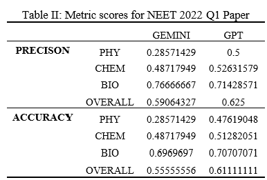

---
# LLM+RAG for Question-Answering in Specialized Domains

## Overview

Large Language Models (LLMs) combined with Retrieval-Augmented-Generation (RAG) have emerged as a powerful approach for question-answering tasks, especially in specialized domains. This project explores the application of LLM+RAG specifically in the context of the National Eligibility-cum-Entrance Test (NEET), a standard Indian medical entrance exam for medical education.

## Objective

The main goal of this project is to leverage LLMs and RAG techniques to provide precise, contextually relevant, and accurate answers to queries related to the NEET examination. By integrating information retrieval from reliable sources with LLM generation, we aim to bridge knowledge gaps and enhance the question-answering system's performance in knowledge-intensive domains.

## Key Components

### LLM Models
- **Gemini-Pro**
- **GPT-3.5-Turbo-0125**

### Embeddings
- **GoogleGenerativeAIEmbeddings**

### Data Source
- **National Council of Educational Research and Training (NCERT) Textbooks**
  - Utilized to extend the knowledge base of LLM models

### Evaluation
- **Ground Truth Answers**
  - Answers were evaluated against the ground truth answers from the 2022 NEET paper

## Project Structure

- **Gemini-Pro Model**: Used for LLM-based question generation and answer prediction.
- **GPT-3.5-Turbo-0125 Model**: Employed for LLM-based question generation and answer prediction.
- **GoogleGenerativeAIEmbeddings**: Utilized for generating embeddings and enhancing context understanding.
- **Chroma Vector DB**: Used for storing and accessing vectors for semantic analysis.
- **NCERT Textbooks**: Sourced as the primary data for knowledge extension and question-answer generation.
- **NEET 2022 Paper**: Questions from this paper were used for evaluation and validation of the system.

## Results and Evaluation

The project's success is measured based on the accuracy, relevance, and contextual understanding of the generated answers compared to the ground truth answers from the NEET 2022 paper. Detailed evaluation metrics and results are provided in the project documentation.

